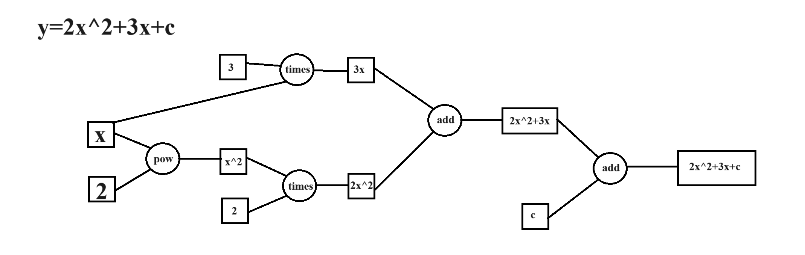
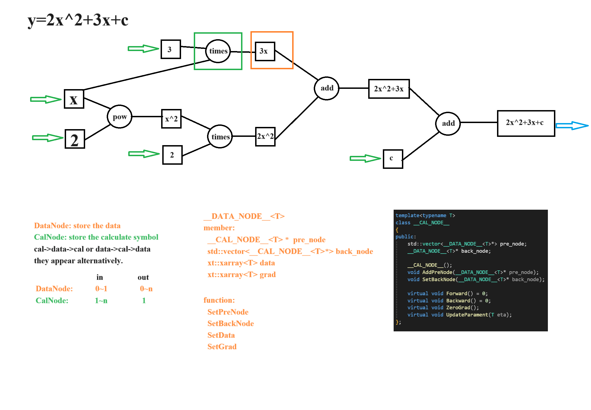

# DLF

## Description

## Features

## Installation

## Useage

## Develop log

### 1. configure the enviroment

what we need is xtensor in c++ and related lib.
make a directory in your porject like DLF/lib. then git clone the following reporsitory in git hub.
if you are to find an easy way just copy the code behind it and execute the code, it also works.

- xtensor `git clone https://github.com/xtensor-stack/xtensor.git`
- xtensor-blas `git clone https://github.com/xtensor-stack/xtensor-blas.git`
- xtensor-python `git clone https://github.com/xtensor-stack/xtensor-python.git`
- xtl `git clone https://github.com/xtensor-stack/xtl.git`

next turn to vs add them include file to the contain.

### 2. datatype node and calculate node

more details see [here](https://www.cnblogs.com/devilmaycry812839668/p/16900550.html)

- datatype.h support common data type
- node.hpp support two nodes: **DATA_NODE** and **CALC_NODE**

here is the data calculation flow chart:

and more detailed info about node
data node has 0~1 inputs, and n outputs
calc node has 1~n inputs, and 1 output

besides we declare forward and backward method in cal node.

### 3. Arithmetics node

when we use cal node,we need to achive forward algorithm and backward algorithm.

- add node
  back_node = forward_node[0] + forward_node[1]
  forward: set back_node with the reslut of forward_node[0] + forward_node[1]
  backward: set the gradient of forward_node[0] and forward_node[1] with the gradient of back_node

I need to add a schematic of forward and backward.
